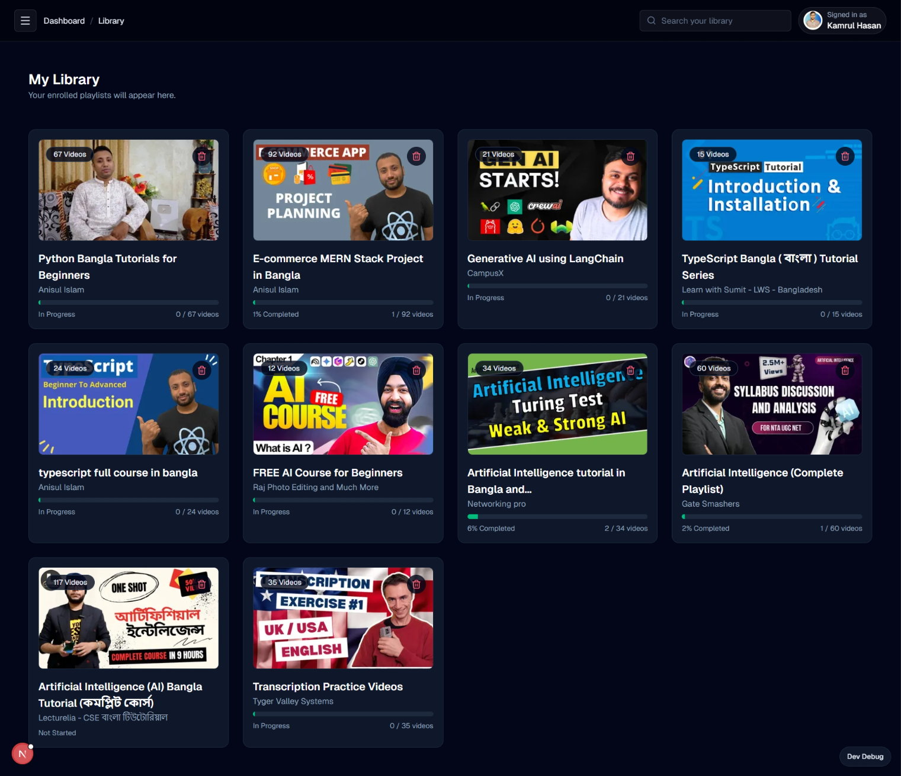
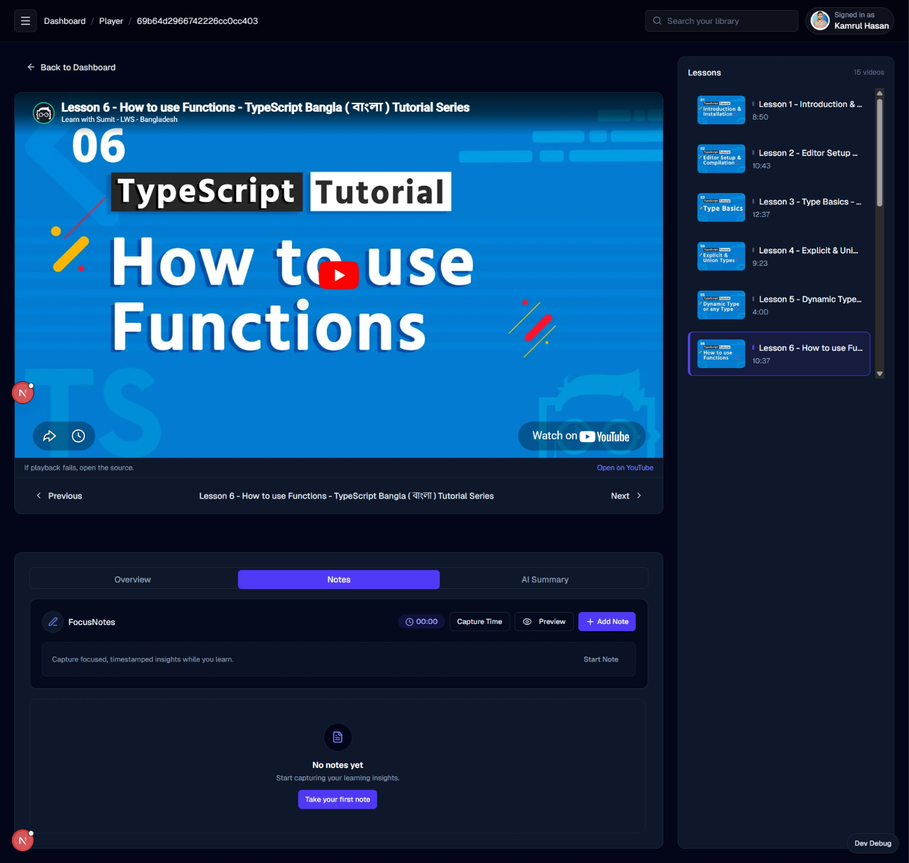
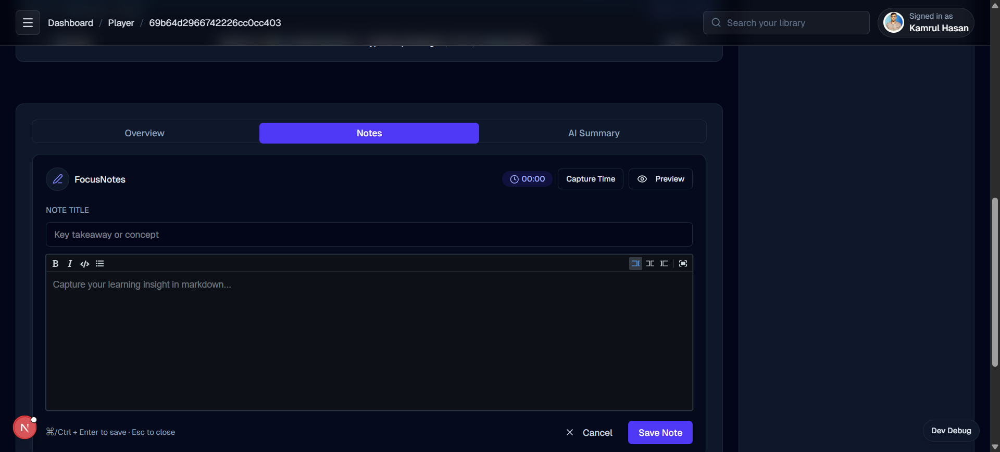

# FocusTube
**Distraction-Free YouTube Learning Platform**

FocusTube transforms any YouTube playlist into a structured, distraction-free course with AI summaries, timestamped notes, and progress tracking.


## Screenshots

- Library:  
- Player Room:  
- Notes UI:  

## Features
- AI Summaries for rapid retention and review
- Smart Notes with timestamped markdown
- Structured playlist learning paths
- Progress tracking and resume learning
- Pro billing with Stripe subscriptions

## Tech Stack
| Layer | Tech |
| --- | --- |
| Frontend | Next.js 16, Tailwind CSS, Shadcn UI, TanStack Query, Zustand |
| Backend | Node.js, Express, MongoDB, Zod |
| Services | Stripe, Backblaze B2, Gemini AI / OpenAI |

## Installation
1. Clone the repository
2. Install dependencies
3. Configure environment variables

```bash
npm install
```

Create `.env` from `.env.example` and fill in your values:

```bash
cp .env.example .env
```

## Environment Variables
See `.env.example` for the full list, including:
- `NEXT_PUBLIC_API_URL`
- `NEXT_PUBLIC_SITE_URL`
- Stripe keys and success/cancel URLs
- Backblaze B2 config
- Gemini/OpenAI keys

## Scripts
```bash
npm run dev
npm run build
npm run start
```

## Performance Targets
This project is optimized for:
- Lighthouse Performance ≥ 90
- Accessibility ≥ 95
- Best Practices ≥ 95
- SEO ≥ 95

## License
© 2026 FocusTube. All rights reserved.

## Contributing
Contributions are welcome! Please open an issue or submit a pull request.

